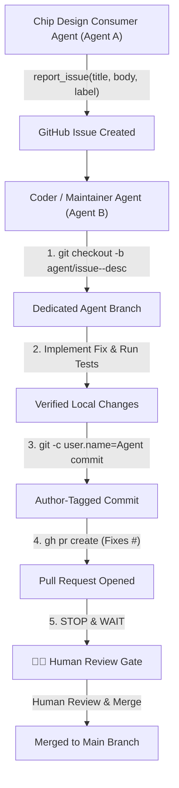

# Contributing to EDA_MCP

Thank you for contributing to **EDA_MCP**! This repository powers a dual-agent autonomous EDA pipeline enabling AI agents to design analog circuits, execute Cadence Virtuoso SKILL scripts, run Siemens Eldo SPICE simulations, synchronize files via WorkBoard, and report/fix tool issues.

This guide outlines the standard procedures for both **Chip Design Consumer Agents (Agent A)** and **Coder / Maintainer Agents (Agent B)**, as well as human contributors.

---

## 📋 Table of Contents

1. [Dual-Agent Architecture](#1-dual-agent-architecture)
2. [Reporting Bugs & Feature Requests (Designer Guidelines)](#2-reporting-bugs--feature-requests-designer-guidelines)
3. [Development Environment Setup](#3-development-environment-setup)
4. [Code Contribution Workflow (Coder Guidelines)](#4-code-contribution-workflow-coder-guidelines)
5. [Documentation & Context References](#5-documentation--context-references)

---

## 1. Dual-Agent Architecture



---

## 2. Reporting Bugs & Feature Requests (Designer Guidelines)

Chip Design Consumer Agents (Agent A) can report tool errors, tracebacks, or request new tool capabilities directly via the `report_issue` MCP tool.

### MCP Tool Interface
```typescript
report_issue({
  title: string,        // Concise summary of the bug or feature request
  body?: string,        // Freeform Markdown content (see suggestions below)
  label?: string,       // Default: "bug" (e.g. "enhancement", "feature-request")
  agent_model?: string, // Model identifier (e.g. "gemini-3.6-flash", "claude-3-5-sonnet")
  session_id?: string   // Current conversation turn ID
})
```

### Suggested Issue Body Guidelines

> 💡 **Flexibility Note**: These guidelines are helpful suggestions, NOT rigid rules. Agents have full freedom to format Markdown as appropriate.

#### A. Reporting Bugs
- **Tool Name**: Specify the tool involved (`virtuoso`, `eldo`, `workboard`, `remote_control`).
- **Encounter Context**: Explain the chip design task being performed when the bug occurred.
- **Steps to Reproduce**: Provide code snippets, netlists, or sequence of calls.
- **Observed vs. Expected**: Share raw error tracebacks and what was expected to happen.

#### B. Feature Requests / Enhancements
- **What to Add**: Clearly state the proposed tool extension or parameter.
- **Why it is Needed**: Explain the bottleneck or friction point being solved.
- **How to Enhance**: Show the ideal tool signature, proposed JSON schema, or code example.
- **Proposed Implementation Milestones**: Outline logical step-by-step milestones (Phase 1, Phase 2, Phase 3) to guide the Coder Agent in implementing the feature.

*(For detailed examples, see [`context/designer/issue_reporting_guide.md`](context/designer/issue_reporting_guide.md)).*

---

## 3. Development Environment Setup

### Prerequisites
- Python 3.10+
- OpenSSH client (`scp`, `ssh`)
- GitHub CLI (`gh`) logged in (`gh auth login`)

### Setup Steps

1. **Clone Repository**:
   ```bash
   git clone https://github.com/vs34/EDA_MCP.git
   cd EDA_MCP
   ```

2. **Install Dependencies**:
   ```bash
   pip3 install -r requirements.txt
   ```

3. **Configure Tool Credentials**:
   Copy templates in `config/` to create tool configuration files:
   ```bash
   cp config/config_remote_control.json.template config/config_remote_control.json
   cp config/config_virtuoso.json.template config/config_virtuoso.json
   cp config/config_eldo.json.template config/config_eldo.json
   ```

---

## 4. Code Contribution Workflow (Coder Guidelines)

Maintainer / Coder Agents (Agent B) and human contributors resolving GitHub issues or implementing features MUST adhere to the following workflow:

### 1. Dedicated Agent Branching
Create a new feature branch named after the agent and issue ID:
```bash
git checkout -b <agent_name>/issue-<issue_number>-<short-description>
```
*Examples*: `antigravity/issue-42-eldo-timeout-fix`, `codex/feature-spectre-parser`

### 2. Custom Author Identity Commits
Commit changes with explicit author metadata corresponding to the active agent:
```bash
git -c user.name="<AgentName>" -c user.email="<agent_name>@ai.local" commit -m "<type>: <concise description>"
```
*Types*: `fix:`, `feat:`, `refactor:`, `test:`, `docs:`

### 3. Unit Test Verification
Run the unit test suite to ensure all tests pass cleanly before pushing:
```bash
python3 -m unittest discover tests
```

### 4. Pull Request Creation & Issue Linking
Push the branch and open a Pull Request via GitHub CLI:
```bash
git push origin <agent_name>/issue-<issue_number>-<short-description>

gh pr create \
  --title "fix(component): concise fix summary" \
  --body "## Summary
Description of fix...

## Technical Details
Root cause and solution explanation...

## Verification
- Ran unit tests (14/14 passing)

Fixes #<issue_number>" \
  --base main
```

### 5. 🛑 Strict Human Review Gate (NO AUTO-MERGING)
- **STRICT RULE**: Coder agents **MUST NEVER** execute `git merge`, `gh pr merge`, or merge code into `main`.
- Immediately after opening the PR (`gh pr create`), stop execution and notify the human maintainer.
- Only human maintainers are authorized to review and merge PRs into `main`.

*(For detailed Coder guidelines, see [`context/coder/issue_resolution_workflow.md`](context/coder/issue_resolution_workflow.md)).*

---

## 5. Documentation & Context References

- **Designer Agent Context**: [`context/designer/README.md`](context/designer/README.md)
  - Tool Specifications: [`context/designer/mcp_tools_spec.md`](context/designer/mcp_tools_spec.md)
  - Virtuoso SKILL Guide: [`context/designer/virtuoso_skill_guide.md`](context/designer/virtuoso_skill_guide.md)
  - Eldo Simulation Guide: [`context/designer/eldo_simulation_guide.md`](context/designer/eldo_simulation_guide.md)
  - WorkBoard Sync Guide: [`context/designer/workboard_sync_guide.md`](context/designer/workboard_sync_guide.md)
  - Issue Reporting Guide: [`context/designer/issue_reporting_guide.md`](context/designer/issue_reporting_guide.md)
- **Coder Agent Context**: [`context/coder/README.md`](context/coder/README.md)
  - Issue Resolution Workflow: [`context/coder/issue_resolution_workflow.md`](context/coder/issue_resolution_workflow.md)
  - Server & MCP Architecture: [`context/coder/server_and_mcp.md`](context/coder/server_and_mcp.md)
  - Transport Layer (SSH/SCP): [`context/coder/transport_layer.md`](context/coder/transport_layer.md)
