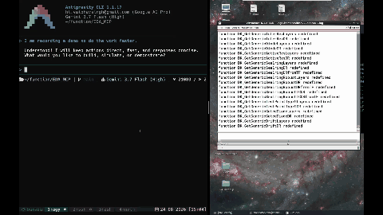

# EDA_MCP Server

[](https://www.python.org/)
[](LICENSE)
[](https://modelcontextprotocol.io/)

> **Bridge local AI Agents (Cursor, Windsurf, Claude Desktop, Antigravity) directly to remote Linux EDA clusters over SSH.**

`EDA_MCP` empowers AI agents to manage remote IC design tools (Cadence Virtuoso, Siemens Eldo), execute SKILL & simulation decks, and synchronize workspace files locally using a **Git-backed WorkBoard architecture** with sub-10ms connection speeds over SSH multiplexing.

> 🤝 **Contributing & Agent Guidelines**: See [`CONTRIBUTING.md`](CONTRIBUTING.md) for full Designer & Coder AI Agent contribution guidelines.

---

## 📹 Demo Video

[](doc/media/My%20Movie.mp4)

<video src="doc/media/My%20Movie.mp4" autoplay loop muted playsinline controls width="100%"></video>

*(Click image above to watch or download full 2-minute MP4 video: [`doc/media/My Movie.mp4`](file:///Users/vs/function/EDA_MCP/doc/media/My%20Movie.mp4))*

---

## 🏛️ Architecture: Local Control Plane + Remote Execution Engine

```
┌──────────────────────────────────────────────────────────┐                      ┌──────────────────────────┐
│              LOCAL SYSTEM (Your Machine)                 │                      │    REMOTE EDA SERVER     │
│                                                          │                      │                          │
│  ┌────────────────────────────────────────────────────┐  │      SSH Tunnel      │  • Cadence Virtuoso      │
│  │               EDA_MCP (FastMCP Server)             │  ├─────────────────────►│  • Siemens Eldo          │
│  │                                                    │  │  (Command & File IO) │  • Raw Remote Files      │
│  │  • Remote Command Exec  • Local Git WorkBoard Sync │  │◄─────────────────────┤  • Netlists & Results    │
│  └────────────────────────────────────────────────────┘  │                      └──────────────────────────┘
└──────────────────────────────────────────────────────────┘
```

---


## 🚀 Key Features & Tools

### 1. 🗂️ WorkBoard (`workboard`)
Git-backed local-remote workspace synchronization and version control:
- **`initialize`**: Creates a new local WorkBoard workspace and initializes a local Git repo.
- **`add`**: Fetches a remote file/folder from any server path to the local WorkBoard and records mapping.
- **`pull`**: Re-fetches the latest version of an added file from the remote server to update the local copy.
- **`push`**: Uploads local edits back to mapped remote server location and commits locally.
- **`export`**: Saves a brand-new local file to a specified remote server location with overwrite protection (`overwrite=True`).
- **`diff`**: Computes line-by-line unified diff between local WorkBoard file and live remote server file.
- **`status`**: Reports tracked file statuses and local Git commit baselines.
- **`history`**: Displays local Git commit log for workspace auditing.

### 2. 🎨 Cadence Virtuoso Control (`virtuoso`)
Full Cadence Virtuoso lifecycle and SKILL command execution:
- **`assisted_run` / `run`**: Executes SKILL statements via non-blocking FIFO IPC (`MCP.command`) and polls results. Automatically initializes session working directory on first invocation.
- **`start_standalone` / `run_standalone`**: Interactive `virtuoso -nograph` REPL streaming session.
- **`exit`**: Gracefully terminates Virtuoso processes.

### 3. ⚡ Siemens Eldo Control (`eldo`)
Siemens/Mentor Graphics Eldo analog simulation control and waveform visualization:
- **`start_interactive` / `run_interactive`**: Spawns and streams commands to interactive `eldo -inter` REPL. Automatically initializes simulation directory on demand.
- **`run_script`**: Runs batch Eldo simulation (`eldo <script.cir>`) and truncates execution logs cleanly.
- **`visualize_waveforms` / `plot`**: Spawns an interactive multi-pane PyQtGraph oscilloscope window (`eldo_plotter.py`) for SPICE transient analysis (`.raw` or `.spi3` files) with linked X-axes, dynamic signal value legends, and synchronized vertical crosshair readout.

### 4. 💻 Remote Control (`remote_control`)
Unified remote shell execution inside persistent, sourced `csh` environments:
- **`run_command`**: Stateful terminal execution maintaining working directory across calls.
- **`read_file`**: Reads remote file contents directly over persistent SSH stdin/stdout.
- **`write_file`**: Creates or updates remote files using Base64 streams.

### 5. 🚀 Meta-Harness Issue Reporter (`report_issue`)
Autonomous agent-to-agent issue and feature request reporting pipeline:
- **`report_issue`**: Allows Agent A (Chip Design Consumer) to report tool bugs, tracebacks, or request new features directly to GitHub without needing knowledge of the underlying `EDA_MCP` Python codebase.
  - **5 Simple Fields**: `title` (Issue Title), `body` (Full Markdown content), `label` (`bug`, `enhancement`, `feature-request`, etc.), `agent_model` (e.g. `gemini-3.6-flash`, `claude-3-5-sonnet`), `session_id`.
  - **Auto-Detected Agent Name**: Automatically detects `agent_name` (`Antigravity`, `claude-code`, `cursor`, etc.) from MCP `clientInfo` initialization context via FastMCP `Context` and auto-creates/attaches the GitHub agent label.
  - **Auto Server Log Attachment**: Automatically injects the active MCP session log file path created in the `temp/` folder (`temp/eda_mcp_YYYYMMDD_HHMMSS_<PID>.log`).


---

## 🛠️ Installation & Setup

### 1. Install Dependencies
```bash
pip3 install -r requirements.txt
```

### 2. Configuration (`config/`)
Configure tool credentials in the [`config/`](config/) directory (see [`config/config_remote_control.json.template`](config/config_remote_control.json.template)):
```json
{
  "ssh_host": "eda-uni",
  "ssh_config_path": "~/.ssh/config",
  "env_setup_cmd": "source /cadence/cshrc"
}
```

> ⚡ **Performance Tip (Sub-10ms Speeds)**: Enable SSH Connection Multiplexing in your local `~/.ssh/config` for instant command and file transfers:
> ```sshconfig
> Host eda-uni
>     ControlMaster auto
>     ControlPath ~/.ssh/control-%r@%h:%p
>     ControlPersist 15m
> ```

---

## 🔌 Configuring with AI Clients

### Claude Desktop
Add to your `claude_desktop_config.json`:
```json
{
  "mcpServers": {
    "eda-mcp": {
      "command": "python3",
      "args": [
        "server.py"
      ]
    }
  }
}
```

### Cursor / Windsurf
Add a new Stdio MCP Server:
- **Name**: `EDA_MCP`
- **Command**: `python3 server.py`

---

## 🏗️ Architecture & Modules

* [`server.py`](server.py): FastMCP server registering tool definitions (`remote_control`, `virtuoso`, `eldo`, `workboard`, `report_issue`).
* [`issue_reporter.py`](issue_reporter.py): Meta-Harness helper formatting structured GitHub issue bodies and invoking `gh` CLI.
* [`workboard_client.py`](workboard_client.py): WorkBoard client managing local Git repositories, `.workboard.json` registries, and unified diffs.
* [`scp_client.py`](scp_client.py): High-speed binary/text transport engine leveraging OpenSSH multiplexing.
* [`ssh_client.py`](ssh_client.py): Low-level SSH transport backbone managing persistent `csh` shell sessions.
* [`virtuoso_client.py`](virtuoso_client.py): Cadence Virtuoso client encapsulating SKILL IPC pipe communication and REPL streams.
* [`eldo_client.py`](eldo_client.py): Siemens Eldo simulation client with interactive REPL streaming and `.extract` reading.

---

## 📜 License

Distributed under the **MIT License**. See [`LICENSE`](LICENSE) for details.
