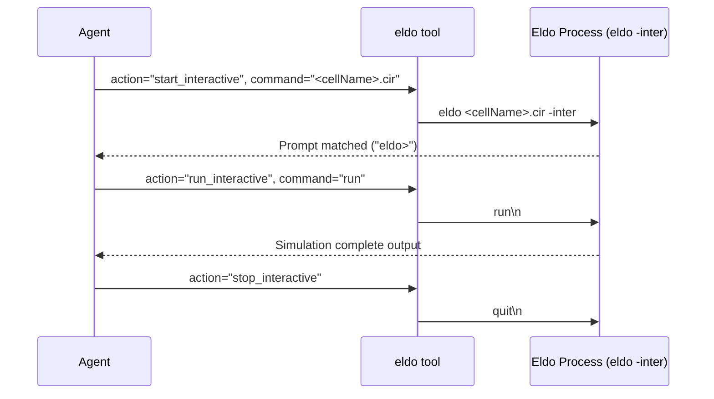

# ELDO_SIMULATION_SPEC

## 1. SPICE Netlist Syntax & Rules
- **Rule 1 (Title Line)**: Line 1 of a `.cir` deck is a title line. Start it with a descriptive comment such as `* Inverter transient test`.
- **Rule 2 (Model fidelity)**: Use the installed `cmos065` model deck for design validation. The standard Level-1 BSIM models used for Eldo simulation in this environment are:
  ```spice
  .MODEL nsvtgp NMOS (LEVEL=1 VTO=0.38 KP=150u TOX=1.85n)
  .MODEL psvtgp PMOS (LEVEL=1 VTO=-0.36 KP=50u TOX=1.85n)
  ```
- **Rule 3 (CDL Parameter Sanitization)**: Cadence `auCdl` netlists frequently contain physical PDK parameters (`NFING=1`, `SENSE=0`, `NGCON=1`, `ACCURATEFLOW=0`). Eldo rejects these with parser errors (`ERROR 254: Unknown parameter NFING`). Ensure exported transistor instances in `<cellName>.net` contain only standard SPICE parameters:
  ```spice
  MMP0 OUT IN VDD VDD psvtgp W=2.0u L=0.065u
  MMN0 OUT IN VSS VSS nsvtgp W=1.0u L=0.065u
  ```

---

## 2. Standard Eldo 2-File & 2-Execution Mode Architecture

### A. Virtuoso CDL/SPICE Netlist Export (`<cellName>.net`)
- The structural netlist file (`<cellName>.net` or `.cdl`) contains transistor connectivity (`.subckt <cellName> ...`).
- **Export Target**: Export from Virtuoso schematic (`MCP` library) via the `"test"` template GUI flow in [`virtuoso_skill_guide.md`](virtuoso_skill_guide.md) to `~/Desktop/eldo/<cellName>.net`. Verify the pin order before simulation.

### B. Execution Modes

#### Mode 1: Interactive REPL Simulation (`eldo(action="start_interactive")` & `run_interactive`)
- Uses the exported `<cellName>.net` structural netlist file.
- The agent writes interactive commands directly into the interactive REPL terminal (`run`, `step`, parameter sweeps, print commands) to observe real-time simulation output.

#### Mode 2: Batch Script Simulation (`eldo(action="run_script")`)
Requires two distinct files:
1. **Structural Netlist (`<cellName>.net`)**: Exported from Virtuoso directly to `~/Desktop/eldo/<cellName>.net`.
2. **Simulation Configuration Deck (`<cellName>.cir`)**: Created locally inside a WorkBoard by the agent (containing `.include "<cellName>.net"`, the verified installed model include, subcircuit instantiation `X1`, pin voltage sources, and simulation controls), reviewed, and then exported/synced to the server using WorkBoard (`workboard`).

```spice
* Eldo Simulation Configuration Deck (<cellName>.cir)
.include "<cellName>.net"
* Include the verified installed cmos065 model deck here.
* Do not assume a file named cmos065.mod exists.

* Instantiate Virtuoso Subcircuit
X1 VIN VOUT VDD GND <cellName>

* Pin Voltage Sources & Stimulus
Vvdd VDD 0 1.2
Vvss GND 0 0
Vvin VIN 0 0.6

* Simulation Controls
.dc Vvin 0 1.2 0.01
.option access
.plot dc v(VOUT)
.end
```

- Run Command: `eldo(action="run_script", command="<cellName>.cir", work_dir="~/Desktop/eldo")`

---

## 3. Post-Simulation Output Retrieval & Local Analysis

After simulation execution finishes:
1. **Download Output Files via WorkBoard**:
   - Use `workboard(action="add", remote_path="~/Desktop/eldo/<cellName>.chi")` or `workboard` file sync to download `.chi`, `.extract`, or log files from the server to the local workspace.
2. **Local Output Analysis**:
   - Analyze the downloaded output files locally to calculate DC operating points, transient delays, AC gain/bandwidth, identify circuit bugs, or present clean formatted results to the user.

### B. WorkBoard Local Review & Transparency Protocol
- **Local File Creation & Sync**: Agents MUST create and edit all Eldo configuration decks (`<cellName>.cir`), netlists, and analysis scripts locally first, then sync them to the server via `workboard`.
- **Netlist Pull for User Review**: Pull the exported Virtuoso netlist (`<cellName>.net`) from `~/Desktop/eldo/` to local workspace using `workboard(action="add")`.
- **User Confidence Rationale**: This local-first workflow provides the user full local transparency to inspect, audit, and review all netlists and simulation scripts before remote execution.

---

## 4. Interactive REPL Execution Sequence



---

## 6. Waveform Visualization (`visualize_waveforms`)

To render simulation results in an oscilloscope viewer window for the user, invoke `eldo(action="visualize_waveforms", ...)` on the `.raw` or `.spi3` simulation output file.

### Guidance for LLM Signal Grouping
- Intelligently group related signals into separate vertical panes for clear timing & signal integrity analysis.
- Keep signals with different units or scales in separate panes (e.g. NEVER mix supply currents `I(VDD)` with logic voltages `V(IN)`).
- Group correlated input/output voltage signals into the same pane for propagation delay measurements (e.g. `V(A)` and `V(Y)`).
- To present large, clear graphs without overcrowding a single layout, call `eldo(action="visualize_waveforms")` multiple times to open separate plot windows for different signal categories.
- Example layout:
  ```json
  [
    {"pane_title": "Logic Inputs & Output", "signals": ["V(A1)", "V(A2)", "V(Y)"]},
    {"pane_title": "Supply Currents", "signals": ["I(VDD)", "I(VSS)"]}
  ]
  ```
