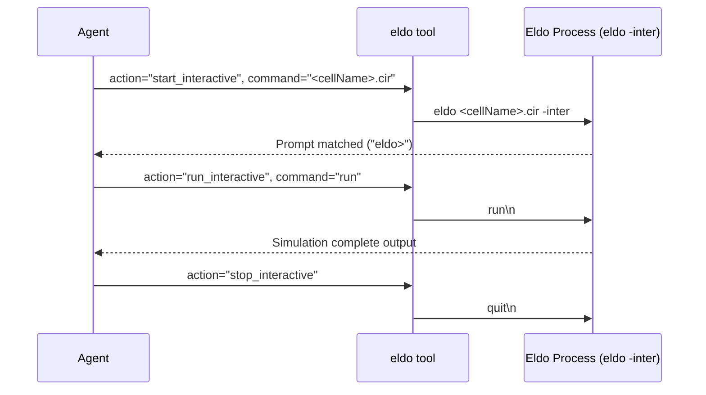

# ELDO_SIMULATION_SPEC

## 1. SPICE Netlist Syntax & Rules
- **Rule 1 (Title Line)**: Line 1 of `.cir` deck is ALWAYS evaluated as Title Comment by Eldo parser.
- **Rule 2 (Level-1 Fallback Model Decks)**:
  ```spice
  .MODEL nsvtgp NMOS (LEVEL=1 VTO=0.38 KP=150u TOX=1.85n)
  .MODEL psvtgp PMOS (LEVEL=1 VTO=-0.36 KP=50u TOX=1.85n)
  ```

---

## 2. Standard Eldo 2-File & 2-Execution Mode Architecture

### A. Virtuoso CDL/SPICE Netlist Export (`<cellName>.net`)
- The structural netlist file (`<cellName>.net` or `.cdl`) contains transistor connectivity (`.subckt <cellName> ...`).
- **Export Target**: Exported programmatically from the Virtuoso schematic cellview (`MCP` library) via CDL SKILL export and saved to the default server Eldo directory: `~/Desktop/eldo/<cellName>.net`.

### B. Execution Modes

#### Mode 1: Interactive REPL Simulation (`eldo(action="start_interactive")` & `run_interactive`)
- Uses the exported `<cellName>.net` structural netlist file.
- The agent writes interactive commands directly into the interactive REPL terminal (`run`, `step`, parameter sweeps, print commands) to observe real-time simulation output.

#### Mode 2: Batch Script Simulation (`eldo(action="run_script")`)
Requires two distinct files:
1. **Structural Netlist (`<cellName>.net`)**: Exported from Virtuoso directly to `~/Desktop/eldo/<cellName>.net`.
2. **Simulation Configuration Deck (`<cellName>.cir`)**: Created **locally** by the agent (containing `.include "<cellName>.net"`, `.include "cmos065.mod"`, subcircuit instantiation `X1`, pin voltage sources `Vvdd`/`Vvin`, and simulation controls `.dc`/`.tran`), and then **exported/synced to the server using WorkBoard (`workboard`)**.

```spice
* Eldo Simulation Configuration Deck (<cellName>.cir)
.include "<cellName>.net"
.include "cmos065.mod"

* Instantiate Virtuoso Subcircuit
X1 VIN VOUT VDD GND <cellName>

* Pin Voltage Sources & Stimulus
Vvdd VDD 0 1.2
Vvss GND 0 0
Vvin VIN 0 0.6

* Simulation Controls
.dc Vvin 0 1.2 0.01
.option access
.plot dc v(VOUT)
.end
```

- Run Command: `eldo(action="run_script", command="<cellName>.cir", work_dir="~/Desktop/eldo")`

---

## 3. Post-Simulation Output Retrieval & Local Analysis

After simulation execution finishes:
1. **Download Output Files via WorkBoard**:
   - Use `workboard(action="add", remote_path="~/Desktop/eldo/<cellName>.chi")` or `workboard` file sync to download `.chi`, `.extract`, or log files from the server to the local workspace.
2. **Local Output Analysis**:
   - Analyze the downloaded output files locally (or call `eldo(action="read_extract")`) to calculate DC operating points, transient delays, AC gain/bandwidth, identify circuit bugs, or present clean formatted results to the user.

### B. WorkBoard Local Review & Transparency Protocol
- **Local File Creation & Sync**: Agents MUST create and edit all Eldo configuration decks (`<cellName>.cir`), netlists, and analysis scripts locally first, then sync them to the server via `workboard`.
- **Netlist Pull for User Review**: Pull the exported Virtuoso netlist (`<cellName>.net`) from `~/Desktop/eldo/` to local workspace using `workboard(action="add")`.
- **User Confidence Rationale**: This local-first workflow provides the user full local transparency to inspect, audit, and review all netlists and simulation scripts before remote execution.

---

## 4. Interactive REPL Execution Sequence



---

## 5. Extracted Measurement Retrieval (`read_extract`)
- Command: `eldo(action="read_extract", work_dir="~/Desktop/eldo")`
- Returns: Latest `.extract` file content string parsed from working directory.

---

## 6. High-Performance PyQtGraph Waveform Visualization (`visualize_waveforms`)

Agents can launch a dynamic, multi-pane PyQtGraph oscilloscope window to plot SPICE transient waveforms directly from standard SPICE3 `.raw` or `.spi3` simulation output files using direct `spicelib`/`PyLTSpice` numerical array parsing.

- **Tool Call**: `eldo(action="visualize_waveforms", file_path="<path_to_sim.raw>", layout=[...])`
- **Supported File Types**: `.raw` or `.spi3` SPICE simulation output files.

### Layout Parameter & Signal Grouping Directives
The `layout` parameter defines how signals are organized into vertically stacked plot panes:

```json
[
  {"pane_title": "Input Stimuli & Output", "signals": ["V(A1)", "V(A2)", "V(Y)"]},
  {"pane_title": "Supply Currents", "signals": ["I(VDD)", "I(VSS)"]}
]
```

#### Intelligent Signal Grouping Guidelines for LLMs:
1. **Correlated Signals**: Group correlated input/output voltage signals into the same pane for propagation delay ($t_{pd}$) and signal transition measurements (e.g. $V(A1)$ and $V(Y)$).
2. **Unit Isolation**: Keep signals with different units or scales in separate panes (e.g. NEVER mix supply currents $I(VDD)$ with logic voltages $V(IN)$).
3. **Automatic Fallback**: If no `layout` is specified, `eldo_plotter.py` automatically categorizes voltage signals into a "Voltages" pane and current signals into a "Currents" pane.
4. **Features**:
   - **Linked X-Axes**: All panes zoom and pan synchronously via `setXLink()`.
   - **Dynamic Legend**: Moving the mouse updates live signal values directly inside each plot pane's legend (e.g., `V(Y): 2.697 V`).
   - **Clean Top Header**: Shows `File: <filename> | Time: <time>` in clean white styling.

