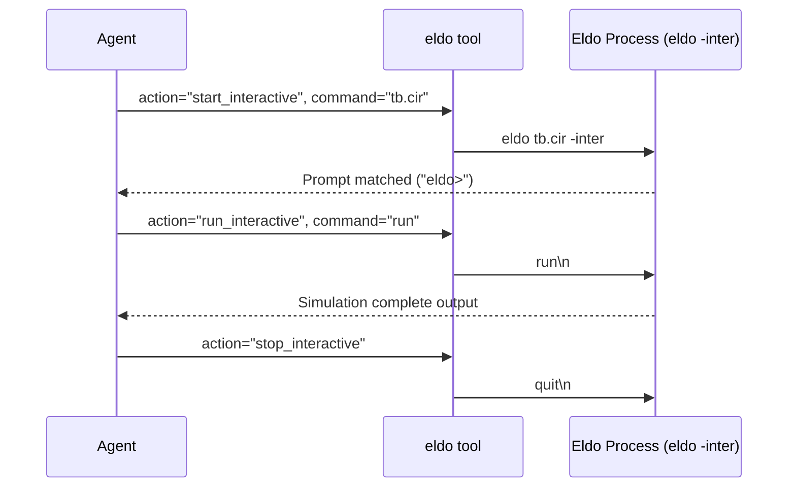

# ELDO_SIMULATION_SPEC

## 1. SPICE Netlist Syntax & Rules
- **Rule 1 (Title Line)**: Line 1 of `.cir` deck is ALWAYS evaluated as Title Comment by Eldo parser.
- **Rule 2 (Level-1 Fallback Model Decks)**:
  ```spice
  .MODEL nsvtgp NMOS (LEVEL=1 VTO=0.38 KP=150u TOX=1.85n)
  .MODEL psvtgp PMOS (LEVEL=1 VTO=-0.36 KP=50u TOX=1.85n)
  ```

---

## 2. Interactive REPL Execution Sequence



---

## 3. Extracted Measurement Retrieval (`read_extract`)
- Command: `eldo(action="read_extract", work_dir="~/Desktop/eldo")`
- Returns: Latest `.extract` file content string parsed from working directory.
